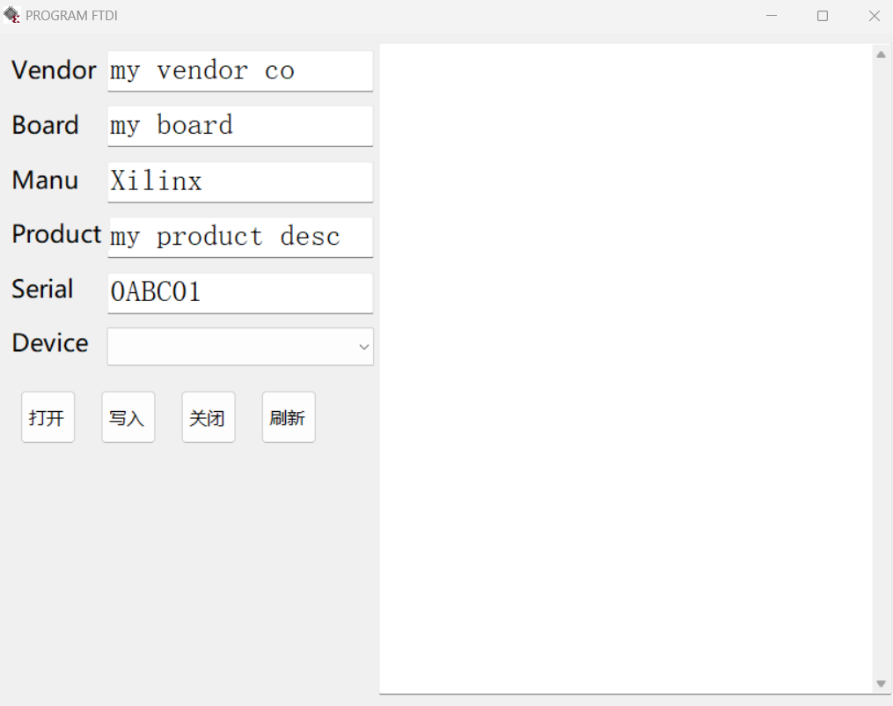

# PROGRAM_FTDI

## 介绍

PROGRAM_FTDI 是一个用于设置和管理 基于 FT232/FT2232/FT4232 的 Xilinx JTAG 设备的序列号信息 Windows Forms 应用程序

## 预览

## 使用环境

- **开发工具**: Visual Studio 2022
- **框架/库**: .NET Framework v4.8
- **依赖库**: FTD2XX_NET

## 重点说明

1. 能否被 Xilinx 工具识别为 JTAG 设备的关键点在于用户区域的 FirmwareId 字段, 该字段根据芯片型号确定
2. 用户字段中还存储了 Vendor 字符串和 Board 字符串
3. 只需要擦除后, 使用 FTDI 的写 EEPROM API 正常写入EEPROM, 随后再使用写 UserArea API 写入 "FirmwareId + Vendor + Board" 即可
4. 如果芯片有多个端口, Xilinx 工具仅使用端口 A 作为 JTAG, 即使修改端口是否使用VCP也没有用

## 参考资料

1. [Xilinx JTAG Support on FTDI](https://etherealwake.com/2024/06/xilinx-ftdi-jtag/)

    这篇文章描述了 eeprom 数据结构

2. [ug908-vivado-programming-debugging](https://docs.amd.com/r/en-US/ug908-vivado-programming-debugging/Programming-FTDI-Devices-for-Vivado-Hardware-Manager-Support)

    这篇文档描述了如何将 FTDI 设备编程为 JTAG 设备